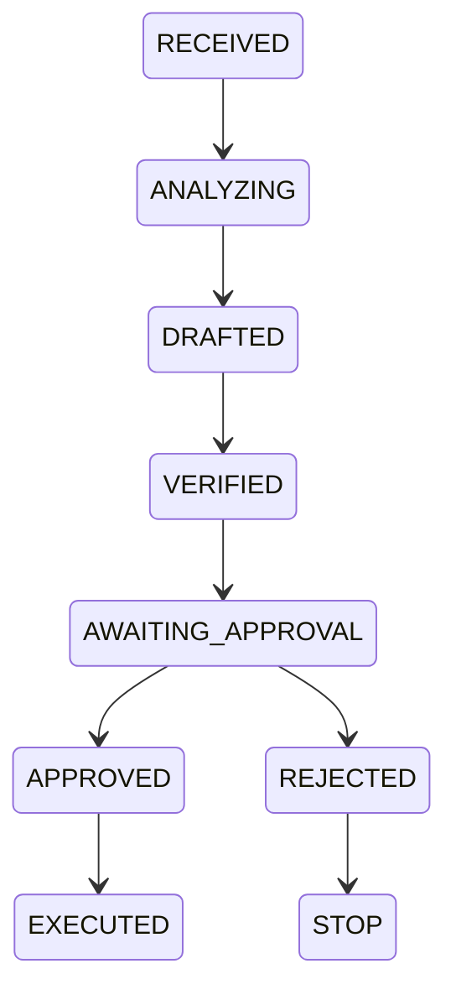

# Gatekeeper

AI prepares the decision. A human authorizes the action.

One-line pitch: Gatekeeper analyzes incoming operational tickets with an AI pipeline (analyze → draft → verify), defends against prompt-injection and policy conflicts, and surfaces a concise human approval gate with an append-only audit trail.

Live demo: https://usegatekeeper.vercel.app

Customer portal: https://usegatekeeper.vercel.app/portal

**Key features**
- Multi-stage AI pipeline: `analyze`, `draft`, `verify`.
- Human Approval Gate: decisions are executed only after a recorded human approval.
- Prompt Injection Defense: verifier detects prompt injection and policy conflicts and marks the ticket visibly.
- Audit History: append-only trail with actor, timestamps, and provenance for every transition.

**Architecture (state machine)**

**Tech stack**
- Next.js 16 (App Router) + TypeScript
- Tailwind CSS + shadcn/ui + Base UI primitives
- Supabase Postgres (schema in `supabase/migrations`)
- Vercel AI SDK and Google Generative AI (Gemini) for model calls
- Vitest + Playwright for tests

See `BUILDSTEPS.md` for detailed local setup and run instructions.

Contributing & testing
- Install: `pnpm install`
- Run dev: `pnpm dev`
- Build: `pnpm build`
- Tests: `pnpm test` (unit), `pnpm test:e2e` (e2e)

If you are evaluating this project as a judge, follow `BUILDSTEPS.md` for exact steps, environment variables, and a migration example.
